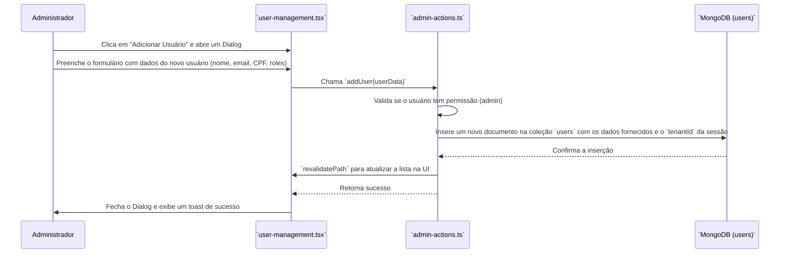
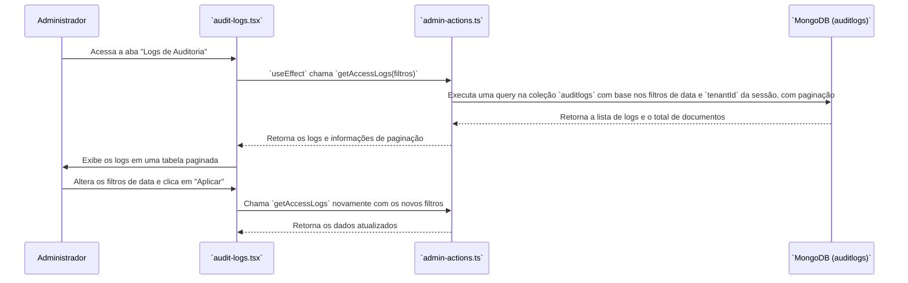

# Módulo do Painel Administrativo

Este documento detalha as funcionalidades do Painel Administrativo, uma área restrita para gerenciamento do sistema, usuários e configurações.

## Visão Geral

O Painel Administrativo é uma área central para usuários com privilégios de administrador (`admin` role). Ele permite a gestão completa de usuários do seu *tenant*, a visualização de logs de auditoria para rastreamento de atividades e a configuração de parâmetros gerais do sistema. O acesso a este painel é restrito por middleware e pelas próprias Server Actions, que validam a role do usuário.

## Componentes e Arquivos Envolvidos

| Arquivo                                             | Camada          | Descrição                                                                                                |
| --------------------------------------------------- | --------------- | -------------------------------------------------------------------------------------------------------- |
| `src/app/[slug]/admin/page.tsx`                     | Apresentação    | Página principal que utiliza um sistema de abas (`Tabs`) para organizar as diferentes seções do painel. |
| `src/shared/components/admin/user-management.tsx`   | Apresentação    | Componente para listar, adicionar, editar e desativar usuários do *tenant*.                              |
| `src/shared/components/admin/audit-logs.tsx`        | Apresentação    | Componente para visualizar, filtrar e paginar os logs de auditoria do sistema.                           |
| `src/shared/components/admin/system-settings.tsx`   | Apresentação    | Componente para visualizar e editar as configurações gerais do sistema para o *tenant*.                  |
| `src/infrastructure/actions/admin-actions.ts`       | Infraestrutura  | Contém as Server Actions que executam a lógica de negócio para todas as operações do painel.           |
| `src/application/schemas/admin.schema.ts`           | Aplicação       | Define os schemas de validação (Zod) para as operações de criação e atualização de usuários.           |
| `src/domain/models/User.ts`                         | Domínio         | Define a interface `IUser`, o modelo de dados para um usuário.                                           |
| `src/domain/models/AuditLog.ts`                     | Domínio         | Define a interface `IAuditLog`, o modelo de dados para um registro de log.                               |

---

## Seção 1: Gerenciamento de Usuários

Esta seção permite que administradores gerenciem o ciclo de vida dos usuários dentro de seu *tenant*.

### Fluxo de Adicionar Usuário



### Funcionalidades:

*   **Listar Usuários**: A `getTenantUsers` action busca todos os usuários associados ao `tenantId` do administrador logado.
*   **Adicionar Usuário**: A `addUser` action cria um novo usuário. O e-mail fornecido aqui será o que o usuário utilizará para fazer login com o Google.
*   **Atualizar Usuário**: A `updateUser` action permite modificar dados como nome, CPF e *roles*.
*   **Desativar Usuário**: A `deactivateUser` action altera o status do usuário para `'inactive'`, impedindo seu acesso ao sistema, mas mantendo o registro.

---

## Seção 2: Logs de Auditoria

Esta seção fornece uma visão transparente de todas as ações significativas que ocorrem no sistema, sendo crucial para segurança e rastreabilidade.

### Fluxo de Visualização de Logs



### Funcionalidades:

*   **Visualização**: A `getAccessLogs` action busca os logs do banco de dados.
*   **Filtragem**: A UI permite filtrar os logs por um intervalo de datas.
*   **Paginação**: Os resultados são paginados para lidar com grandes volumes de dados de forma eficiente.
*   **Rastreabilidade**: Cada log registra quem (`userName`, `userId`), o quê (`actionType`, `resourceType`), em qual recurso (`resourceId`) e quando (`timestamp`) uma ação ocorreu.

---

## Seção 3: Configurações do Sistema

Permite que administradores ajustem parâmetros de funcionamento do sistema para seu *tenant*.

### Funcionalidades:

*   **Visualização**: A `getSystemSettingsAction` busca as configurações atuais do *tenant* no banco. Se não existirem, cria um conjunto de configurações padrão.
*   **Atualização**: A `updateSystemSettingsAction` salva as modificações. A lógica de `upsert: true` garante que, se não houver um documento de configuração, ele será criado na primeira vez que for salvo.
*   **Parâmetros Configuráveis**: Incluem nome da empresa, limites de vagas, regras para links compartilháveis, etc.

## Modelos de Dados

### `IUser`

Define a estrutura do usuário, incluindo `roles` e `tenantId`, que são fundamentais para o controle de acesso no painel administrativo.

### `IAuditLog`

```typescript
export interface IAuditLog {
  _id?: string;
  userId: string;      // Quem realizou a ação
  userName: string;
  actionType: string;  // Ex: "Criar Vaga", "Atualizar Usuário"
  resourceType: string;// Ex: "Job", "User"
  resourceId?: string;  // ID do objeto afetado
  details?: string;     // Detalhes adicionais
  success: boolean;    // Se a ação foi bem-sucedida
  timestamp: Date;     // Quando a ação ocorreu
}
```

## Regras de Negócio

*   **Acesso Restrito a Admins**: O acesso a todas as funcionalidades do painel é estritamente controlado. O `createLoggedAction` wrapper e, se necessário, verificações manuais dentro das actions garantem que apenas usuários com a *role* `'admin'` possam executar operações administrativas.
*   **Isolamento de Tenant**: Todas as actions (`getTenantUsers`, `getAccessLogs`, etc.) são rigorosamente filtradas pelo `tenantId` extraído da sessão do usuário. Isso garante que um administrador de uma empresa não possa, em nenhuma circunstância, ver ou modificar dados de outra.
*   **Imutabilidade dos Logs**: Logs de auditoria, uma vez escritos, não devem ser alterados. Não há actions para editar ou deletar logs.
