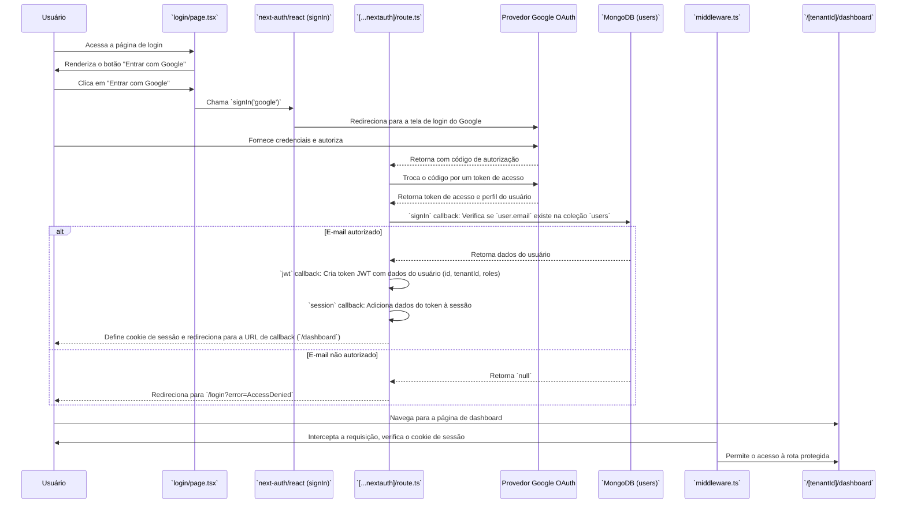
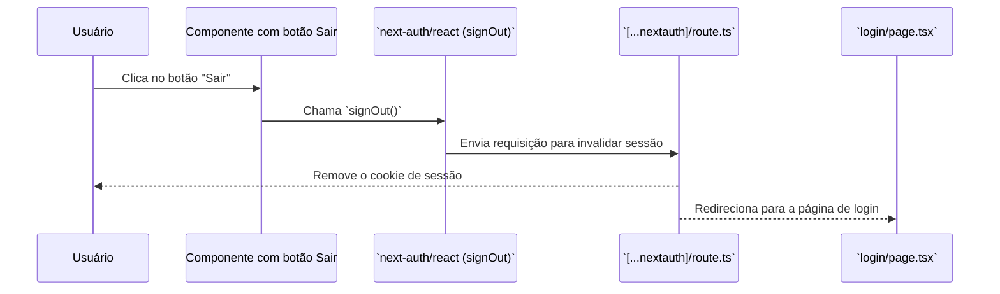

# Módulo de Autenticação

Este documento detalha o fluxo de autenticação do sistema, que utiliza **NextAuth.js** com o provedor **Google OAuth**.

## Visão Geral

O sistema permite que usuários acessem a plataforma exclusivamente através de suas contas Google. O acesso é restrito a e-mails previamente cadastrados no banco de dados, garantindo que apenas usuários autorizados possam fazer login.

## Componentes e Arquivos Envolvidos

| Arquivo                                           | Camada          | Descrição                                                                                             |
| ------------------------------------------------- | --------------- | ----------------------------------------------------------------------------------------------------- |
| `src/app/login/page.tsx`                          | Apresentação    | Renderiza a UI da página de login, incluindo o botão "Entrar com Google".                             |
| `src/app/api/auth/[...nextauth]/route.ts`         | Infraestrutura  | Ponto de entrada da API do NextAuth.js, onde a configuração do provedor Google e os callbacks são definidos. |
| `src/infrastructure/auth/auth.ts`                 | Infraestrutura  | Contém a configuração principal do NextAuth.js, incluindo provedores e callbacks de sessão/JWT.     |
| `middleware.ts`                                   | Infraestrutura  | Intercepta requisições para proteger rotas, redirecionando usuários não autenticados para `/login`.   |
| `src/domain/models/User.ts`                       | Domínio         | Define a interface `IUser`, que representa o modelo de dados de um usuário no sistema.                |
| `src/infrastructure/persistence/db.ts`            | Infraestrutura  | Fornece funções para obter a coleção de usuários do MongoDB.                                          |
| `src/shared/hooks/use-auth.ts`                    | Compartilhado   | Hook React que abstrai a lógica de `signIn` e `signOut` do NextAuth.js para uso nos componentes.      |

## Fluxo de Autenticação (Login)

O fluxo de login é iniciado quando o usuário clica no botão "Entrar com Google" na página de login.



### Detalhes do Fluxo:

1.  **Início do Login**: O componente `LoginPage` utiliza o hook `useAuth`, que por sua vez chama a função `signIn('google')` do `next-auth/react`.
2.  **Autenticação Google**: O usuário é redirecionado para o fluxo de OAuth do Google. Após o login e consentimento, o Google redireciona de volta para a aplicação, especificamente para o endpoint `/api/auth/callback/google`.
3.  **Callback `signIn`**: O backend do NextAuth.js (em `[...nextauth]/route.ts`) intercepta o callback. A função `signIn` é executada:
    *   Ela verifica se o e-mail retornado pelo Google existe na coleção `users` do MongoDB.
    *   **Regra de Negócio**: Se o e-mail não for encontrado, o login falha e o usuário é redirecionado para a página de login com uma mensagem de erro.
    *   Se o usuário existe, o processo continua. O `googleId` do usuário é salvo no banco de dados se for o primeiro login com Google.
4.  **Callback `jwt`**: Após o `signIn` bem-sucedido, este callback é chamado para criar o JSON Web Token (JWT). As informações essenciais do usuário (`_id`, `tenantId`, `roles`, `isAdmin`) são buscadas no banco e codificadas no token.
5.  **Callback `session`**: Este callback garante que os dados do JWT (como `tenantId` e `roles`) sejam injetados no objeto `session` do NextAuth, tornando-os disponíveis tanto no cliente quanto no servidor.
6.  **Redirecionamento**: O usuário é redirecionado para a página de dashboard (`/[tenantId]/dashboard`), agora autenticado.

## Proteção de Rotas com Middleware

O arquivo `middleware.ts` é crucial para a segurança, pois protege as rotas da aplicação.

```mermaid
graph TD
    A[Requisição para uma rota] --> B{É uma rota pública?};
    B -- Sim --> C[Permite acesso];
    B -- Não --> D{Usuário está autenticado? (Verifica cookie)};
    D -- Sim --> C;
    D -- Não --> E[Redireciona para /login];

```

### Detalhes do Middleware:

*   **Rotas Públicas**: Rotas como `/login` e `/public/*` são definidas em `PUBLIC_PATHS` e são acessíveis por qualquer pessoa.
*   **Verificação de Token**: Para todas as outras rotas, o middleware verifica a presença e a validade do cookie de sessão (`next-auth.session-token`).
*   **Redirecionamento**: Se o cookie não existir ou for inválido, o usuário é imediatamente redirecionado para a página `/login`.

## Modelos de Dados e Interfaces

### `IUser` (domain/models/User.ts)

A interface `IUser` define a estrutura de um documento de usuário no MongoDB.

```typescript
export interface IUser extends IBaseEntity {
  _id?: ObjectId;
  cpf: string;
  slug: string;
  name: string;
  email: string;
  googleId?: string; // ID do usuário no Google
  tenantId: string;  // Identificador do "inquilino" (empresa)
  roles: string[];   // Ex: ['admin', 'recruiter']
  permissions: string[];
  isAdmin: boolean;
  status: 'active' | 'inactive';
  // ... outros campos
}
```

### `session` e `token` (NextAuth)

O NextAuth estende os tipos `Session` e `JWT` para incluir os dados customizados da aplicação.

```typescript
// Em @types/next-auth.d.ts (exemplo)
import NextAuth from "next-auth";

declare module "next-auth" {
  interface Session {
    user: {
      id: string;
      tenantId: string;
      roles: string[];
      isAdmin: boolean;
    } & DefaultSession["user"];
  }
}

declare module "next-auth/jwt" {
  interface JWT {
    id: string;
    tenantId: string;
    roles: string[];
    isAdmin: boolean;
  }
}
```

## Regras de Negócio

*   **Acesso Restrito**: Apenas usuários com e-mails pré-cadastrados na coleção `users` podem se autenticar.
*   **Associação com Tenant**: Cada usuário está obrigatoriamente associado a um `tenantId`, garantindo o isolamento de dados entre diferentes empresas (multi-tenancy).
*   **Persistência de Sessão**: A sessão do usuário é mantida através de um cookie JWT gerenciado pelo NextAuth.js.
*   **Logout**: A ação de logout (`signOut`) invalida o cookie de sessão e redireciona o usuário para a página de login.

## Fluxo de Logout


