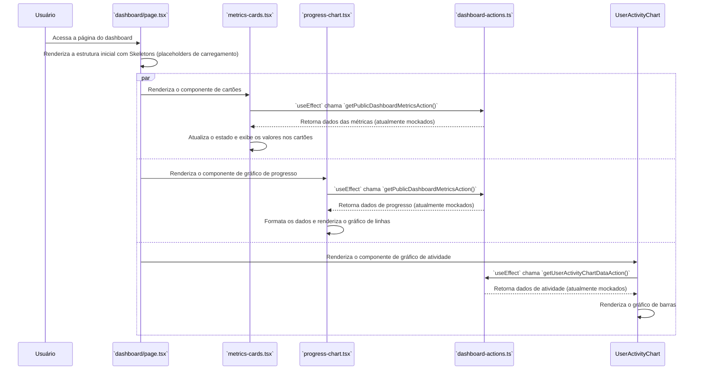

# Módulo de Dashboard

Este documento detalha a estrutura e o funcionamento do Dashboard, a principal central de visualização de dados e métricas do sistema.

## Visão Geral

O Dashboard apresenta uma visão consolidada das principais métricas e atividades da plataforma. Ele é composto por cartões de métricas, gráficos de progresso e gráficos de atividade do usuário, permitindo que os recrutadores e administradores monitorem a saúde e a eficiência do processo de recrutamento.

**Importante**: Atualmente, as Server Actions (`dashboard-actions.ts`) que alimentam o dashboard retornam **dados mockados**. A integração com o banco de dados para buscar métricas reais (ex: agregações da coleção `jobs`, `candidates` e `auditlogs`) é um próximo passo planejado.

## Componentes e Arquivos Envolvidos

| Arquivo                                             | Camada          | Descrição                                                                                              |
| --------------------------------------------------- | --------------- | ------------------------------------------------------------------------------------------------------ |
| `src/app/[slug]/dashboard/page.tsx`                 | Apresentação    | A página principal que monta o layout do dashboard, unindo o cabeçalho, os cartões e os gráficos.      |
| `src/shared/components/dashboard/dashboard-header.tsx`  | Apresentação    | O cabeçalho do dashboard, que inclui o título e o seletor de período (ex: últimos 30 dias).           |
| `src/shared/components/dashboard/metrics-cards.tsx`     | Apresentação    | Renderiza os cartões com as métricas chave (KPIs) como total de vagas, candidatos, etc.                |
| `src/shared/components/dashboard/progress-chart.tsx`    | Apresentação    | Renderiza o gráfico de linhas que mostra o progresso de vagas e candidatos ao longo do tempo.          |
| `src/shared/components/dashboard/user-activity-chart.tsx` | Apresentação    | Renderiza o gráfico de barras que exibe a atividade dos usuários (logins, ações).                      |
| `src/infrastructure/actions/dashboard-actions.ts`   | Infraestrutura  | Contém as Server Actions para buscar os dados necessários para popular os componentes do dashboard.    |
| `src/shared/types/types/dashboard-interface.ts`     | Compartilhado   | Define as interfaces (`ISystemMetrics`, `IUserActivityData`) para a estrutura dos dados do dashboard. |

## Fluxo de Carregamento do Dashboard

O carregamento do dashboard é um processo assíncrono que ocorre no lado do cliente. Cada componente do dashboard é responsável por buscar seus próprios dados.



### Detalhes do Fluxo:

1.  **Renderização Inicial**: A `DashboardPage` é renderizada. Ela contém um estado para o `period` (período de tempo) e passa esse estado para os componentes filhos.
2.  **Componentes Independentes**: `MetricsCards`, `ProgressChart`, e `UserActivityChart` são montados.
3.  **Busca de Dados**: Cada um desses componentes, dentro de um hook `useEffect`, chama a Server Action apropriada de `dashboard-actions.ts` para buscar seus dados. Enquanto os dados não chegam, eles exibem um componente de `Skeleton` para indicar o carregamento.
4.  **Server Actions**: As actions (`getPublicDashboardMetricsAction`, `getUserActivityChartDataAction`) executam a lógica para buscar os dados. **Atualmente, elas retornam dados estáticos (mockados)**.
5.  **Renderização Final**: Assim que os dados retornam da Server Action, o estado de cada componente é atualizado, e os `Skeletons` são substituídos pelos cartões e gráficos preenchidos com os dados.

## Estrutura dos Dados

As interfaces em `dashboard-interface.ts` definem os contratos de dados entre o backend (actions) e o frontend (componentes).

### `ISystemMetrics`

Usada pelos `MetricsCards` e `ProgressChart`.

```typescript
export interface ISystemMetrics {
  totalUsers: number;
  activeUsers: number;
  totalJobs: number;
  totalCandidates: number;
  systemUptime: string;
  avgResponseTime: string;
  // Arrays para os gráficos
  jobsCreated: Array<{ date: string; count: number }>;
  candidatesApplied: Array<{ date: string; count: number }>;
  hires: Array<{ date: string; count: number }>;
}
```

### `IUserActivityData`

Usada pelo `UserActivityChart`.

```typescript
export interface IUserActivityData {
  name: string; // Ex: 'Seg', 'Ter', 'Qua'
  logins: number;
  acoes: number; // Total de ações registradas no AuditLog
}
```

## Regras de Negócio e Próximos Passos

*   **Filtragem por Período**: A UI permite que o usuário altere o período de visualização. Esse valor é passado para as Server Actions, que (no futuro) o utilizarão para filtrar as queries no banco de dados.
*   **Segurança**: As actions são protegidas pelo `createLoggedAction`, garantindo que apenas usuários autenticados e pertencentes ao `tenantId` correto possam acessar os dados.
*   **Próximo Passo Crucial**: A principal melhoria para este módulo é substituir os dados mockados nas `dashboard-actions.ts` por agregações reais do MongoDB. Isso envolverá a criação de pipelines de agregação complexos nas coleções `users`, `jobs`, `candidates` e, especialmente, `auditlogs` para calcular as métricas dinamicamente.
