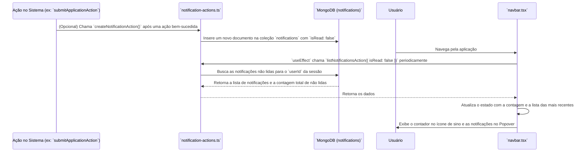
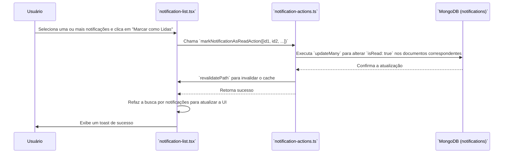

# Módulo de Notificações Internas

Este documento detalha o sistema de notificações internas, projetado para manter os usuários informados sobre eventos importantes na plataforma.

## Visão Geral

O sistema de notificações fornece alertas em tempo real para os usuários sobre eventos relevantes, como novas candidaturas em uma vaga, mudanças de status, ou alertas do sistema. As notificações são acessíveis através de um ícone de sino na barra de navegação principal (`Navbar`) e em uma página dedicada para gerenciamento completo.

## Componentes e Arquivos Envolvidos

| Arquivo                                                  | Camada          | Descrição                                                                                                |
| -------------------------------------------------------- | --------------- | -------------------------------------------------------------------------------------------------------- |
| `src/shared/components/navbar.tsx`                       | Apresentação    | Contém o ícone de sino (`Bell`) e o `Popover` que exibe as notificações mais recentes e o contador de não lidas. |
| `src/shared/components/notifications/notification-list.tsx` | Apresentação    | Componente que renderiza a lista completa de notificações, com filtros e ações de gerenciamento.       |
| `src/shared/components/notifications/notification-item.tsx` | Apresentação    | Componente individual que representa uma única notificação na lista.                                     |
| `src/infrastructure/actions/notification-actions.ts`     | Infraestrutura  | Contém as Server Actions para criar, listar, marcar como lida e excluir notificações.                    |
| `src/domain/models/Notification.ts`                      | Domínio         | Define a interface `INotification`, que representa a estrutura de uma notificação no banco de dados.     |

## Fluxo de Geração e Visualização

O fluxo começa quando uma ação no sistema (como uma nova candidatura) dispara a criação de uma notificação. A `Navbar` busca periodicamente por novas notificações para manter o usuário atualizado.



### Detalhes do Fluxo:

1.  **Criação (Trigger)**: Uma notificação é criada por outra Server Action (ex: quando um candidato se inscreve, a `submitApplicationAction` poderia chamar a `createNotificationAction`). A notificação é criada com `isRead: false` e associada a um `recipientId` (o ID do usuário que deve recebê-la).
2.  **Busca Periódica**: O componente `Navbar` contém um `useEffect` que chama a `listNotificationsAction` a cada 60 segundos. Isso garante que a contagem de notificações não lidas seja atualizada sem a necessidade de recarregar a página.
3.  **Exibição**: A `Navbar` exibe um contador vermelho sobre o ícone de sino se houver notificações não lidas. Ao clicar no sino, um `Popover` é aberto, mostrando as 5 notificações mais recentes.

---

## Gerenciamento de Notificações

O componente `NotificationList` oferece uma interface completa para o usuário gerenciar todas as suas notificações.

### Funcionalidades:

*   **Filtragem**: O usuário pode filtrar a lista para ver "Todas", "Lidas" ou "Não Lidas".
*   **Seleção em Massa**: É possível selecionar múltiplas notificações (ou todas) usando checkboxes.
*   **Ações em Massa**: Com base na seleção, o usuário pode:
    *   **Marcar como Lidas**: Chama a `markNotificationAsReadAction`.
    *   **Excluir**: Chama a `deleteNotificationAction`.

### Fluxo de Marcar como Lida



## Modelo de Dados

### `INotification`

A interface `INotification` define a estrutura de uma notificação.

```typescript
export interface INotification extends IBaseEntity {
  recipientId: string; // ID do usuário que recebe a notificação
  senderId?: string;    // ID de quem enviou (opcional, pode ser o sistema)
  senderName?: string;  // Nome de quem enviou
  type: string;        // Ex: "job_application", "system_alert"
  message: string;     // A mensagem da notificação
  resourceId?: string;  // ID do recurso relacionado (ex: ID da vaga)
  isRead: boolean;     // `true` se lida, `false` se não lida
  readAt?: Date;        // Data da leitura
  tenantId: string;    // ID do Tenant para isolamento de dados
}
```

## Regras de Negócio

*   **Escopo por Usuário**: Um usuário só pode ver e gerenciar as notificações destinadas a ele (`recipientId`). Todas as actions são seguras e usam o `userId` da sessão para filtrar as queries.
*   **Atualização em Tempo Real (Simulada)**: A `Navbar` busca por novas notificações em um intervalo fixo para manter a UI atualizada, simulando uma experiência em tempo real.
*   **Revalidação de Cache**: As actions que modificam o estado das notificações (`markNotificationAsReadAction`, `deleteNotificationAction`) utilizam `revalidatePath` do Next.js para garantir que as visualizações que dependem desses dados sejam atualizadas na próxima requisição.
