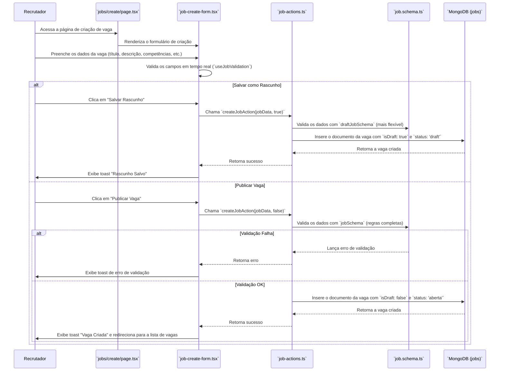

# Módulo de Gerenciamento de Vagas (Job Management)

Este documento detalha o fluxo de criação, gerenciamento e visualização de vagas no sistema.

## Visão Geral

O módulo de Gerenciamento de Vagas permite que recrutadores (usuários com as devidas permissões) criem, publiquem, atualizem e monitorem as vagas de emprego. O sistema suporta a criação de rascunhos, publicação de vagas, e a definição de detalhes complexos como competências com pesos, perguntas para candidatos e critérios de avaliação.

## Componentes e Arquivos Envolvidos

| Arquivo                                      | Camada          | Descrição                                                                                                |
| -------------------------------------------- | --------------- | -------------------------------------------------------------------------------------------------------- |
| `src/app/[slug]/jobs/create/page.tsx`        | Apresentação    | Página que renderiza o formulário de criação de vaga.                                                    |
| `src/shared/components/jobs/job-create-form.tsx` | Apresentação    | Componente React que contém a lógica do formulário de criação/edição de vagas, incluindo validações.   |
| `src/app/[slug]/jobs/page.tsx`               | Apresentação    | Página principal que exibe a lista de vagas (`JobsView`).                                                |
| `src/app/[slug]/jobs/[jobId]/page.tsx`       | Apresentação    | Página que exibe os detalhes de uma vaga específica (`JobDetails`).                                      |
| `src/infrastructure/actions/job-actions.ts`  | Infraestrutura  | Contém as Server Actions para operações CRUD (Criar, Ler, Atualizar, Deletar) de vagas.                  |
| `src/application/schemas/job.schema.ts`      | Aplicação       | Define os schemas de validação (Zod) para os dados de uma vaga, garantindo a integridade dos dados.      |
| `src/domain/models/Job.ts`                   | Domínio         | Define a interface `IJob`, representando a estrutura de dados de uma vaga no domínio da aplicação.        |

## Fluxo de Criação de Vaga

O fluxo de criação de uma vaga começa na página de criação e envolve o preenchimento do formulário e a submissão dos dados através de uma Server Action.



### Detalhes do Fluxo:

1.  **Renderização**: A página `CreateJobPage` renderiza o componente `JobCreateForm`.
2.  **Preenchimento e Validação**: O usuário preenche o formulário. O hook `useJobValidation` é usado para fornecer feedback de validação em tempo real, comparando os dados com as regras definidas no `jobSchema`.
3.  **Submissão**: O usuário pode optar por "Salvar Rascunho" ou "Publicar Vaga".
    *   **Rascunho**: A action `createJobAction` é chamada com o parâmetro `isDraft = true`. Um schema de validação mais permissivo (`draftJobSchema`) é utilizado. A vaga é salva no banco com `status: 'draft'`.
    *   **Publicar**: A action é chamada com `isDraft = false`. O schema completo (`jobSchema`) é aplicado. Se a validação passar, a vaga é salva com `status: 'aberta'`.
4.  **Persistência**: A `createJobAction` enriquece os dados da vaga com informações da sessão (como `createdBy`, `tenantId`), gera um `slug` e insere o novo documento na coleção `jobs` do MongoDB.
5.  **Feedback**: O usuário recebe um toast de sucesso ou erro, e é redirecionado para a lista de vagas em caso de publicação bem-sucedida.

## Listagem e Visualização de Vagas

-   **Listagem (`JobsView`)**: Este componente chama a `listJobsAction` para buscar e exibir uma lista paginada de vagas, permitindo filtros por status e busca por título.
-   **Detalhes (`JobDetails`)**: Esta página busca os dados completos de uma vaga usando a `getJobByIdAction` e os exibe para o usuário.

## Atualização e Exclusão

-   **Atualização**: A `updateJobAction` é usada para modificar os dados de uma vaga existente. Ela recebe o `jobId` e um objeto com os campos a serem alterados. O `updateJobSchema` (que torna todos os campos opcionais) é usado para validação.
-   **Mudança de Status**: A `updateJobStatusAction` é uma action específica para alterar o status de uma vaga (ex: de 'aberta' para 'triagem'), registrando um log da alteração.
-   **Exclusão**: A `deleteJobAction` remove uma vaga do banco de dados, verificando se o usuário tem permissão para realizar a ação.

## Modelos de Dados e Schemas

### `IJob` (domain/models/Job.ts)

A interface `IJob` é o modelo central do domínio, definindo todas as propriedades de uma vaga.

```typescript
export interface IJob extends IBaseEntity {
  slug: string;
  title: string;
  description: string;
  competencies: ICompetency[]; // Subdocumento de competências
  questions: IJobQuestion[];   // Subdocumento de perguntas
  isPCDExclusive: boolean;
  status: IJobStatus;          // Ex: 'draft', 'aberta', 'fechada'
  isDraft: boolean;
  createdBy: string;           // ID do usuário que criou
  createdByName: string;       // Nome do usuário que criou
  tenantId: string;
  // ... outros campos
}
```

### `jobSchema` (application/schemas/job.schema.ts)

O Zod schema é usado para validar os dados antes de persistir no banco, garantindo a consistência.

```typescript
export const jobSchema = z.object({
  title: z.string().min(5, "..."),
  description: z.string().min(100, "..."),
  status: z.enum(JOB_STATUS_VALUES).default("draft"),
  competencies: z.array(competencySchema).min(3, "Deve haver no mínimo 3 competências."),
  // ... outras regras
});
```

## Regras de Negócio

*   **Validação de Rascunho vs. Publicação**: Rascunhos têm regras de validação mais frouxas do que vagas publicadas.
*   **Mínimo de Competências**: Uma vaga publicada deve ter no mínimo 3 competências definidas.
*   **Geração de Slug**: Um `slug` (URL amigável) é gerado automaticamente a partir do título da vaga no momento da criação.
*   **Log de Status**: Toda mudança no status da vaga é registrada em um log (`statusChangeLog`) com informações de quem alterou e quando.
*   **Controle de Acesso**: As actions verificam o `tenantId` da sessão para garantir que um usuário só possa gerenciar as vagas de sua própria organização.
*   **Permissão de Exclusão**: Apenas o criador da vaga ou um administrador pode excluí-la.
