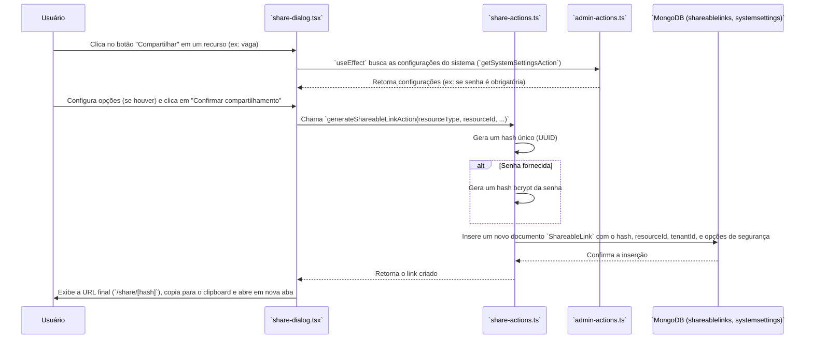
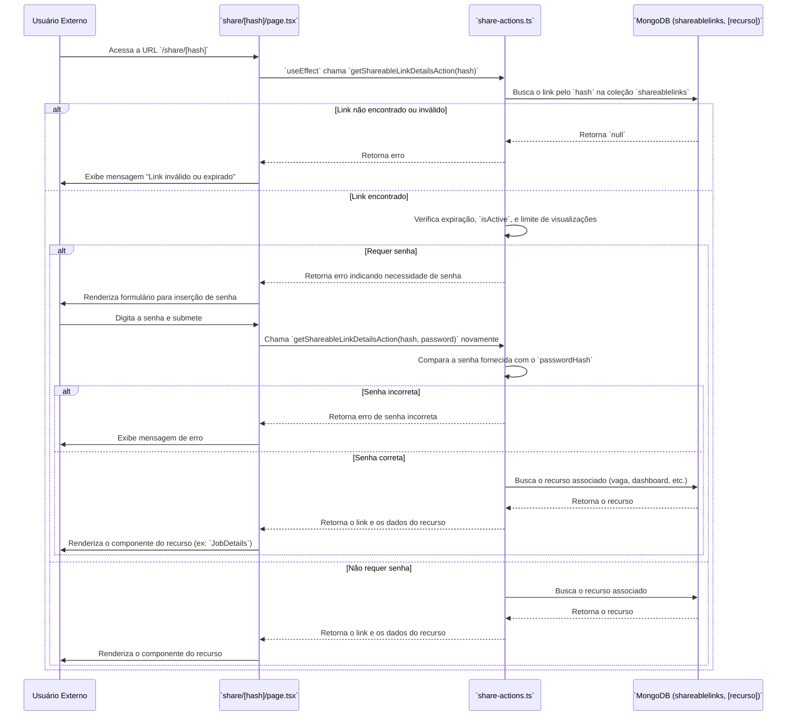

# Módulo de Compartilhamento de Links (Link Sharing)

Este documento detalha a funcionalidade de compartilhamento de recursos, que permite gerar links públicos e seguros para vagas, relatórios e dashboards.

## Visão Geral

A funcionalidade de compartilhamento de links permite que usuários autenticados criem URLs únicas e seguras para compartilhar recursos do sistema com pessoas externas. O sistema suporta a criação de links para diferentes tipos de recursos, com opções de segurança como proteção por senha e data de expiração, que são configuradas globalmente no Painel de Administração.

## Componentes e Arquivos Envolvidos

| Arquivo                                      | Camada          | Descrição                                                                                                |
| -------------------------------------------- | --------------- | -------------------------------------------------------------------------------------------------------- |
| `src/app/share/[hash]/page.tsx`              | Apresentação    | Página pública dinâmica que resolve o link compartilhado. Ela lida com a verificação de senha e renderiza o recurso correspondente. |
| `src/shared/components/share-dialog.tsx`     | Apresentação    | Componente de diálogo (modal) que permite ao usuário gerar e configurar um novo link compartilhável.     |
| `src/infrastructure/actions/share-actions.ts`| Infraestrutura  | Contém as Server Actions para criar, verificar, e desativar links compartilháveis.                       |
| `src/domain/models/ShareableLink.ts`         | Domínio         | Define a interface `IShareableLink`, que representa a estrutura de um link no banco de dados.            |
| `src/application/schemas/share.schema.ts`    | Aplicação       | Define os schemas de validação (Zod) para a criação e verificação de links.                              |

## Fluxo de Geração de Link

O processo é iniciado por um usuário autenticado através do `ShareDialog`.



### Detalhes do Fluxo:

1.  **Iniciação**: O usuário abre o `ShareDialog` a partir de um recurso.
2.  **Configuração**: O diálogo busca as configurações do sistema para saber se senhas são obrigatórias e qual a data de expiração padrão.
3.  **Geração**: Ao confirmar, a `generateShareableLinkAction` é chamada.
4.  **Criação do Link**: A action cria um hash universalmente único (UUID v4) para o link. Se uma senha for fornecida, ela é criptografada com `bcrypt` antes de ser salva.
5.  **Persistência**: Um novo documento `IShareableLink` é salvo na coleção `shareablelinks`.
6.  **Feedback**: O usuário recebe a URL final, que é copiada para a área de transferência e aberta em uma nova aba para verificação.

---

## Fluxo de Acesso ao Link Compartilhado

Uma pessoa externa acessa a URL `.../share/[hash]`.



### Detalhes do Fluxo:

1.  **Resolução da Página**: A página dinâmica `share/[hash]/page.tsx` é carregada.
2.  **Verificação do Link**: A `getShareableLinkDetailsAction` é chamada para validar o hash.
3.  **Validação de Segurança**: A action verifica se o link existe, está ativo, não expirou e não atingiu o limite de visualizações. Se o link tiver um `passwordHash`, a action retorna um erro indicando que a senha é necessária.
4.  **Prompt de Senha**: Se a senha for necessária, a página renderiza um formulário para que o usuário a insira.
5.  **Busca do Recurso**: Uma vez que o link é validado (e a senha, se necessária, é verificada), a action busca o recurso correspondente (`job`, `dashboard`, etc.) em sua respectiva coleção no banco de dados.
6.  **Renderização**: A página `SharedResourcePage` recebe os dados do recurso e renderiza o componente apropriado para exibi-lo (ex: `<JobDetails />`).

## Modelos de Dados

### `IShareableLink`

```typescript
export interface IShareableLink extends IBaseEntity {
  resourceType: "job" | "candidate_report" | "dashboard";
  resourceId: string;      // ID do recurso original
  resourceName: string;    // Nome do recurso para exibição
  hash: string;            // O hash único na URL
  tenantId: string;
  expiresAt?: Date;       // Data de expiração opcional
  passwordHash?: string;  // Hash da senha (se protegida)
  viewsCount: number;      // Contador de visualizações
  isActive: boolean;       // Se o link está ativo ou não
  // ... outros campos
}
```

## Regras de Negócio

*   **Unicidade**: Cada link tem um `hash` único gerado por UUID v4.
*   **Segurança da Senha**: As senhas nunca são armazenadas em texto plano. `bcrypt` é usado para criar um hash seguro.
*   **Configurações Globais**: As regras de negócio para compartilhamento (como obrigatoriedade de senha e tempo de expiração padrão) são definidas nas Configurações do Sistema no Painel Administrativo, permitindo que cada *tenant* personalize sua política de segurança.
*   **Invalidação**: Um link pode ser desativado através da `deactivateShareableLinkAction`, que define `isActive` como `false`.
