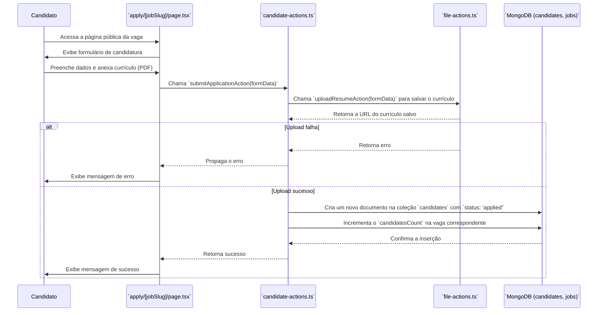
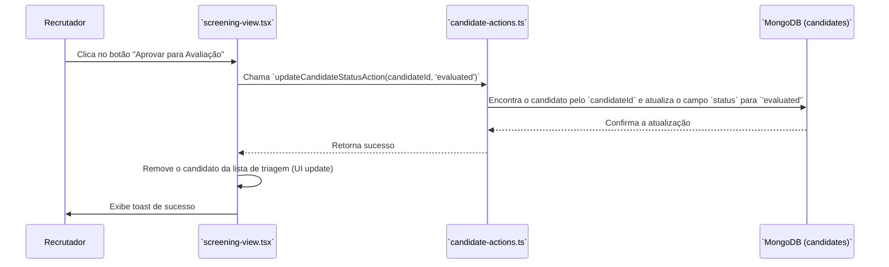

# Módulo de Processo de Recrutamento

Este documento detalha as etapas do processo de recrutamento, desde a candidatura até a avaliação, explicando os fluxos e componentes envolvidos.

## Visão Geral

O processo de recrutamento é dividido em etapas sequenciais para organizar o fluxo de trabalho do recrutador. As principais etapas documentadas aqui são:

1.  **Candidatura (Application)**: Onde um candidato se inscreve para uma vaga.
2.  **Triagem (Screening)**: A primeira fase de análise dos candidatos que se inscreveram.
3.  **Avaliação (Evaluation)**: Uma análise mais aprofundada dos candidatos aprovados na triagem.

## Fluxo de Candidatura

Um candidato pode se inscrever para uma vaga através de uma página pública.



### Detalhes do Fluxo:

1.  **Acesso**: O candidato acessa a página de uma vaga, geralmente através de um link público.
2.  **Submissão**: O candidato preenche um formulário com suas informações e anexa o currículo. A `submitApplicationAction` é chamada.
3.  **Upload de Arquivo**: A `submitApplicationAction` primeiro delega o upload do currículo para a `uploadResumeAction`. Esta action é responsável por salvar o arquivo (potencialmente em um serviço de storage como S3) e retornar sua URL.
4.  **Criação do Candidato**: Com a URL do currículo em mãos, um novo documento `Candidate` é criado no MongoDB. O status inicial é definido como `'applied'`.
5.  **Atualização da Vaga**: O contador de candidatos (`candidatesCount`) na vaga correspondente é incrementado.

---

## Etapa 1: Triagem (Screening)

A página de Triagem é a primeira parada para os recrutadores analisarem os novos candidatos.

-   **Componente Principal**: `src/shared/components/screening/screening-view.tsx`
-   **Página**: `src/app/[slug]/screening/page.tsx`

### Funcionalidades:

*   **Listagem**: Exibe candidatos com o status `'applied'` ou `'screening'`.
*   **Filtros**: Permite filtrar candidatos por vaga, facilitando a análise focada.
*   **Ações**: Para cada candidato, o recrutador pode:
    *   **Aprovar para Avaliação**: Altera o status do candidato para `'evaluated'`.
    *   **Reprovar**: Altera o status do candidato para `'rejected'`.
    *   **Ver Detalhes**: Abre um modal com mais informações sobre o candidato.

### Fluxo de Aprovação na Triagem



---

## Etapa 2: Avaliação (Evaluation)

Candidatos aprovados na triagem aparecem na página de Avaliação para uma análise mais detalhada.

-   **Componente Principal**: `src/shared/components/evaluation/evaluation-view.tsx`
-   **Página**: `src/app/[slug]/evaluation/page.tsx`

### Funcionalidades:

*   **Listagem**: Exibe candidatos com o status `'evaluated'`.
*   **Ordenação**: Permite ordenar os candidatos por nível de "match" com a vaga (lógica a ser implementada pela IA).
*   **Ações**:
    *   **Aprovar para Contato**: Altera o status para `'contacted'`.
    *   **Reprovar**: Altera o status para `'rejected'`.

O fluxo de mudança de status nesta etapa é análogo ao da Triagem, utilizando a mesma `updateCandidateStatusAction` com diferentes parâmetros de status.

## Modelos de Dados e Schemas

### `ICandidate` (domain/models/Candidate.ts)

Representa um candidato que se aplicou a uma vaga.

```typescript
export interface ICandidate extends IBaseEntity {
  jobId: string;       // ID da vaga à qual se aplicou
  tenantId: string;
  name: string;
  email: string;
  resumeUrl: string;   // URL para o currículo
  status: 'applied' | 'screening' | 'evaluated' | 'contacted' | 'rejected';
  matchScore?: number; // Pontuação de compatibilidade (IA)
  answers?: Array<{ questionId: string; answer: string }>;
}
```

### `applySchema` (application/schemas/candidate.schema.ts)

Valida os dados enviados pelo formulário de candidatura.

```typescript
export const applySchema = z.object({
  jobId: z.string().min(1, '...'),
  name: z.string().min(1, '...'),
  email: z.string().email('...'),
  resumeUrl: z.string().url('...'),
  // ...
});
```

## Regras de Negócio

*   **Fluxo de Status**: Um candidato progride pelos status de forma sequencial: `applied` -> `screening` -> `evaluated` -> `contacted`. Um candidato pode ser movido para `'rejected'` de qualquer etapa.
*   **Isolamento por Tenant**: Todas as queries e actions relacionadas a candidatos são filtradas pelo `tenantId` do usuário logado, garantindo que recrutadores só vejam candidatos de sua empresa.
*   **Contador de Candidatos**: A submissão de uma nova candidatura atualiza atomicamente o contador na entidade `Job`.
